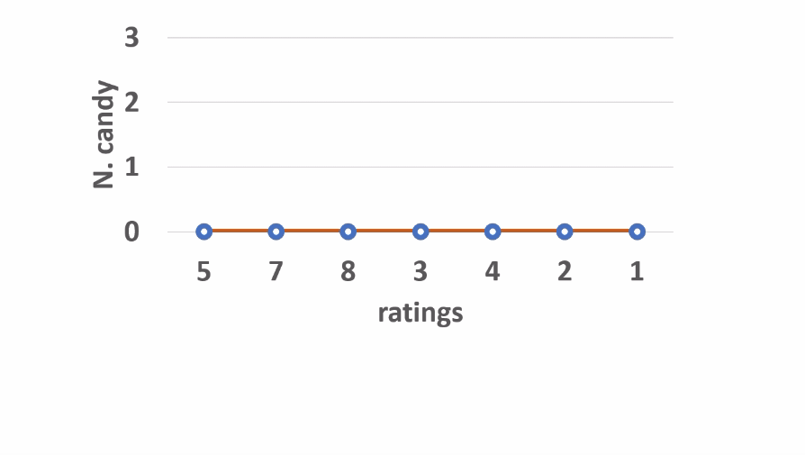
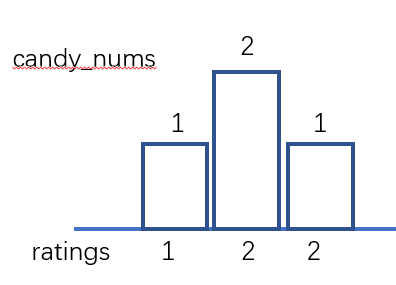
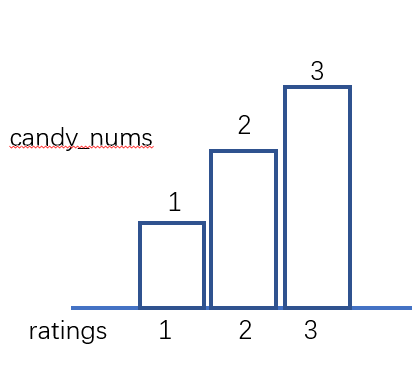
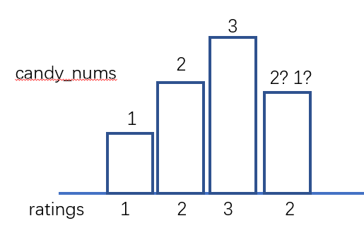
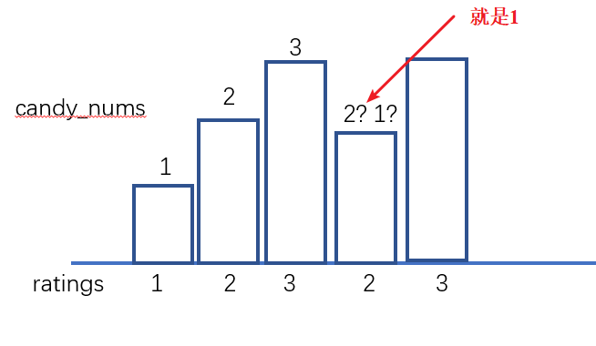
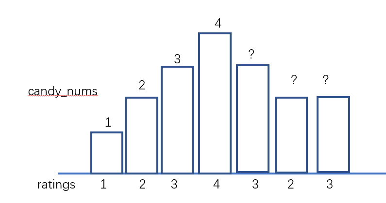
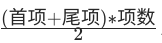
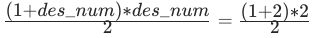
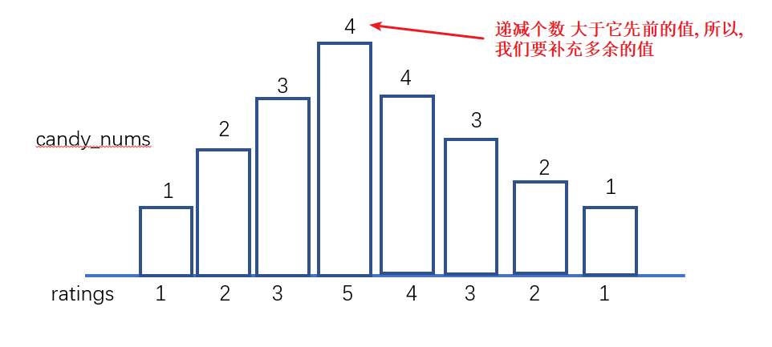

#### [135. 分发糖果](https://leetcode-cn.com/problems/candy/)

老师想给孩子们分发糖果，有 N 个孩子站成了一条直线，老师会根据每个孩子的表现，预先给他们评分。

你需要按照以下要求，帮助老师给这些孩子分发糖果：

每个孩子至少分配到 1 个糖果。
相邻的孩子中，评分高的孩子必须获得更多的糖果。
那么这样下来，老师至少需要准备多少颗糖果呢？

```
示例 1:

输入: [1,0,2]
输出: 5
解释: 你可以分别给这三个孩子分发 2、1、2 颗糖果。

示例 2:

输入: [1,2,2]
输出: 4
解释: 你可以分别给这三个孩子分发 1、2、1 颗糖果。
     第三个孩子只得到 1 颗糖果，这已满足上述两个条件。
```

#### 解题思路

- 先从左至右遍历学生成绩 ratings，按照以下规则给糖，并记录在 ascend 中：
  - 先给所有学生 1 颗糖（Golang里面可以先给第一个人一颗糖）；
  - 若 ratings<sub>i</sub> > ratings<sub>i-1</sub>，则第 i 名学生糖比第 i - 1 名学生多 1 个。
  - 若  ratings<sub>i</sub> <= ratings<sub>i-1</sub> ，则第 i 名学生糖数量不变。（交由从右向左遍历时处理。）

- 经过此规则分配后，可以保证所有学生糖数量 满足升序规则 。

同理，在此规则下从右至左遍历学生成绩并记录在 descend 中，可以保证所有学生糖数量 满足降序规则 。

最终，取以上 2 轮遍历 ascend 和 descend 对应学生糖果数的 最大值 ，这样则同时满足左规则和右规则 ，即得到每个同学的最少糖果数量。

**动画演示：**

**代码演示（Golang）**

```go
func candy(ratings []int) int {
	n := len(ratings)
	ascend := make([]int, n)
	descend := make([]int, n)
	res := 0
	for i, r := range ratings {
		if i > 0 && r > ratings[i-1] {
			ascend[i] = ascend[i-1] + 1
		} else {
			ascend[i] = 1
		}
	}
	for i := n - 1; i >= 0; i-- {
		if i < n-1 && ratings[i] > ratings[i+1] {
			descend[i] = descend[i+1] + 1
		}else {
			descend[i] = 1
		}
	}
	for i := range ratings {
		res += max(ascend[i], descend[i])
	}
	return res
}

func max(a,b int) int {
	if a > b {
		return a
	}
	return b
}
```

> 时间复杂度：O(n)，其中 n 是孩子的数量。我们需要遍历两次数组以分别计算满足左规则或右规则的最少糖果数量。
>
> 空间复杂度：O(n)，其中 n 是孩子的数量。我们需要保存所有的升序规则和降序规则对应的糖果数量。


#### **优化：可以不创造descend数组存储降序的数量，只要在降序的时候一边判断一边比较输出结果即可**

**代码演示（Golang）**

```go
func candy(ratings []int) int {
	n := len(ratings)
	ascend := make([]int, n)
	res := 0
	for i, r := range ratings {
		if i > 0 && r > ratings[i-1] {
			ascend[i] = ascend[i-1] + 1
		} else {
			ascend[i] = 1
		}
	}
	descend := 0
	for i := n - 1; i >= 0; i-- {
		if i < n-1 && ratings[i] > ratings[i+1] {
			descend++
		}else {
			descend = 1
		}
		res += max(ascend[i], descend)
	}
	return res
}

func max(a,b int) int {
	if a > b {
		return a
	}
	return b
}
```

> 时间复杂度：O(n)，其中 n 是孩子的数量。我们需要遍历两次以分别计算满足左规则或右规则的最少糖果数量。
>
> 空间复杂度：O(n)，其中 n 是孩子的数量。我们需要保存所有的升序规则对应的糖果数量。
>

#### **空间再优化**

我们从左到右枚举每一个同学，记前一个同学分得的糖果数量为 pre：

- 如果当前同学比上一个同学评分高，说明我们就在最近的递增序列中，直接分配给该同学 pre+1 个糖果即可。

- 否则我们就在一个递减序列中，我们直接分配给当前同学一个糖果，并把该同学所在的递减序列中所有的同学都再多分配一个糖果，以保证糖果数量还是满足条件。
  - 我们无需显式地额外分配糖果，只需要记录当前的递减序列长度，即可知道需要额外分配的糖果数量。
  - 同时注意当当前的递减序列长度和上一个递增序列等长时，需要把最近的递增序列的最后一个同学也并进递减序列中。

这样，我们只要记录当前递减序列的长度 dec，最近的递增序列的长度 asc 和前一个同学分得的糖果数量 pre 即可。

**举例：**

如何判断 i 位置需要多少糖果，我们需要处理有三种情况:

1. `ratings[i - 1] == ratings[i]`，那么我们只需要 1 糖果



2. `ratings[i - 1] < ratings[i]`，那么我们只需要比前一个多一块糖果



3. `ratings[i - 1] > ratings[i]`，那么我们不知道如何判断了，比如:




但是，如果知道**递减**的个数，我们就能判断最少的糖果了



所以我们保证，递减序列，是从 1 开始加的(方向加)，再举个例子:



如何判读 ? 的糖果多少，我们发现 ratings是3 - 2 递减的，递减序列个数 为`des_num`，我们反向加，

有公差为 1 的求和公式首项尾项项数，所以我们先假设 rating 在等于 4 时候也是满足等差的，所以，有糖果,所以 ratings 是 3 - 2 对于的糖果说 2 - 1

但是还有一种可能, 如下图所示：



**代码演示（Golang）**

```go
func candy(ratings []int) int {
	n := len(ratings)
	//res 记录结果
	//pre 记录升序序列的前一个糖果数
	//inc、dec记录升序降序序列长度（注意12342中，inc=len(1234）=4 ,dec = len(2) = 1 )
	res, inc, dec, pre := 1, 1, 0, 1
	for i := 1; i < n; i++ {
		//当前为升序
		if ratings[i] >= ratings[i-1] {
			//降序标志为0
			dec = 0
			//当相邻相等时，不用考虑大小关系，因为没有规定相等分数一定要相等，所以默认设置最小值1
			if ratings[i] == ratings[i-1] {
				pre = 1
			} else {
				pre++
			}
			res += pre
			//记录下升序序列长度
			inc = pre
		} else {
			//处于降序序列，降序标志+1
			dec++
			//当降序序列与升序序列相等时，需要在这个基础上+1
			//如分数：123 21
			//糖果数可为123 21
			//但是当分数为：123 210
			//糖果数只能为124 321，糖果数的降序序列增加了
			if dec == inc {
				dec++
			}
			res += dec
			//由降序变为升序时候，最后一个降序的糖果数一定是1
			pre = 1
		}
	}
	return res
}
```

> 时间复杂度：O(n)，其中 n 是孩子的数量。我们需要遍历两次数组以分别计算满足左规则或右规则的最少糖果数量。
>
> 空间复杂度：O(1)。我们只需要常数的空间保存若干变量。
>