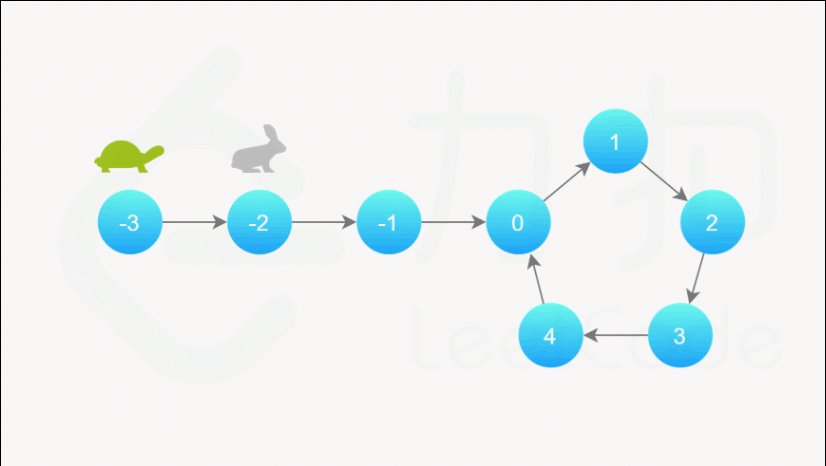

#### [141. 环形链表](https://leetcode-cn.com/problems/linked-list-cycle/)

给定一个链表，判断链表中是否有环。

如果链表中有某个节点，可以通过连续跟踪 next 指针再次到达，则链表中存在环。 为了表示给定链表中的环，我们使用整数 pos 来表示链表尾连接到链表中的位置（索引从 0 开始）。 如果 pos 是 -1，则在该链表中没有环。注意：pos 不作为参数进行传递，仅仅是为了标识链表的实际情况。

如果链表中存在环，则返回 true 。 否则，返回 false 。

进阶：

你能用 O(1)（即，常量）内存解决此问题吗？


```
示例 1：

输入：head = [3,2,0,-4], pos = 1
输出：true
解释：链表中有一个环，其尾部连接到第二个节点。

示例 2：

输入：head = [1,2], pos = 0
输出：true
解释：链表中有一个环，其尾部连接到第一个节点。

示例 3：

输入：head = [1], pos = -1
输出：false
解释：链表中没有环。

提示：

链表中节点的数目范围是 [0, 104]
-105 <= Node.val <= 105
pos 为 -1 或者链表中的一个有效索引 。
```


#### 解题思路：

此题为「[Floyd 判圈算法](https://blog.csdn.net/u012534831/article/details/74231581)」（又称龟兔赛跑算法）。

假想「乌龟」和「兔子」在链表上移动，「兔子」跑得快，「乌龟」跑得慢。当「乌龟」和「兔子」从链表上的同一个节点开始移动时，如果该链表中没有环，那么「兔子」将一直处于「乌龟」的前方；如果该链表中有环，那么「兔子」会先于「乌龟」进入环，并且一直在环内移动。等到「乌龟」进入环时，由于「兔子」的速度快，它一定会在某个时刻与乌龟相遇，即套了「乌龟」若干圈。

我们可以根据上述思路来解决本题。具体地，我们定义两个指针，一快一满。慢指针每次只移动一步，而快指针每次移动两步。初始时，慢指针在位置 head，而快指针在位置 head.next。这样一来，如果在移动的过程中，快指针反过来追上慢指针，就说明该链表为环形链表。否则快指针将到达链表尾部，该链表不为环形链表。

**动画图解：**




**代码演示：**

```java
/**
 * Definition for singly-linked list.
 * class ListNode {
 *     int val;
 *     ListNode next;
 *     ListNode(int x) {
 *         val = x;
 *         next = null;
 *     }
 * }
 */
public class Solution {
    public boolean hasCycle(ListNode head) {
        if(head == null || head.next == null) return false;
        ListNode fast = head.next;
        ListNode slow = head;
        while(slow != fast) {
            if(fast == null || fast.next == null) return false;
            slow = slow.next;
            fast = fast.next.next;
        }
        return true;
    }
}
```

> - 时间复杂度：O(N)，其中 N 是链表中的节点数。
>   - 当链表中不存在环时，快指针将先于慢指针到达链表尾部，链表中每个节点至多被访问两次。
>   - 当链表中存在环时，每一轮移动后，快慢指针的距离将减小一。而初始距离为环的长度，因此至多移动 N 轮。
>
> - 空间复杂度：O(1)。我们只使用了两个指针的额外空间。

