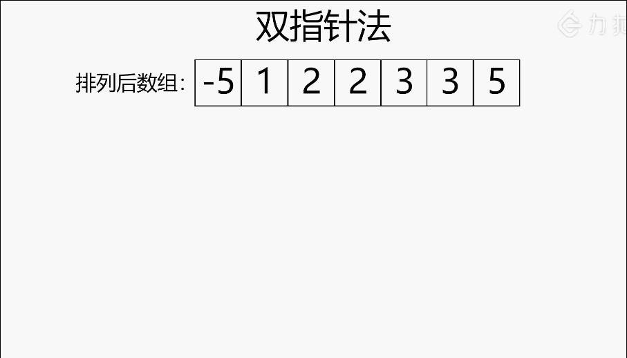

#### [18. 四数之和](https://leetcode-cn.com/problems/4sum/)

给定一个包含 n 个整数的数组 nums 和一个目标值 target，判断 nums 中是否存在四个元素 a，b，c 和 d ，使得 a + b + c + d 的值与 target 相等？找出所有满足条件且不重复的四元组。

注意：

答案中不可以包含重复的四元组。

```
示例：

给定数组 nums = [1, 0, -1, 0, -2, 2]，和 target = 0。

满足要求的四元组集合为：
[
  [-1,  0, 0, 1],
  [-2, -1, 1, 2],
  [-2,  0, 0, 2]

]
```

#### 解题思路：

四数之和，和「[15. 三数之和](https://leetcode-cn.com/problems/3sum/)」是一个思路，都是使用双指针法, 基本解法就是在三数之和 的基础上再套一层for循环。

三数之和的双指针解法是一层for循环`num[i]`为确定值，然后循环内有left和right下表作为双指针，找到`nums[i] + nums[left] + nums[right] == 0`。

四数之和的双指针解法是两层for循环`nums[k] + nums[i]`为确定值，依然是循环内有left和right下表作为双指针，找出`nums[k] + nums[i] + nums[left] + nums[right] == target`的情况，三数之和的时间复杂度是O(n^2^)，四数之和的时间复杂度是O(n^3^) 。

那么一样的道理，五数之和、六数之和等等都采用这种解法。

对于三数之和双指针法就是将原本暴力O(n^3^)的解法，降为O(n^2^)的解法，四数之和的双指针解法就是将原本暴力O(n^4^)的解法，降为O(n^3^)的解法。

**动画图解：**




**代码演示：**

```java
import java.util.ArrayList;
import java.util.Arrays;
import java.util.List;

class Solution {
    public List<List<Integer>> fourSum(int[] nums, int target) {
        List<List<Integer>> res = new ArrayList<List<Integer>>();
        if (nums == null || nums.length < 4) {
            return res;
        }
        Arrays.sort(nums);
        int length = nums.length;
        for (int first = 0; first < length - 3; first++) {
            //防止出现重复的四元组
            if (first > 0 && nums[first] == nums[first - 1]) {
                continue;
            }
            //如果最小的四个数相加都大于target 退出循环(剪枝)
            if (nums[first] + nums[first + 1] + nums[first + 2] + nums[first + 3] > target) {
                break;
            }
            //如果当前nums[first]+最大的三个数<target，first++，进行下一轮循环（剪枝）
            if (nums[first] + nums[length - 3] + nums[length - 2] + nums[length - 1] < target) {
                continue;
            }
            for (int second = first + 1; second < length - 2; second++) {
                if (second > first + 1 && nums[second] == nums[second - 1]) {
                    continue;
                }
                if (nums[first] + nums[second] + nums[second + 1] + nums[second + 2] > target) {
                    break;
                }
                if (nums[first] + nums[second] + nums[length - 2] + nums[length - 1] < target) {
                    continue;
                }
                int left = second + 1, right = length - 1;
                while (left < right) {
                    int sum = nums[first] + nums[second] + nums[left] + nums[right];
                    if (sum == target) {
                        res.add(Arrays.asList(nums[first], nums[second], nums[left], nums[right]));
                        //防止出现重复的四元组
                        while (left < right && nums[left] == nums[left + 1]) {
                            left++;
                        }
                        left++;
                        while (left < right && nums[right] == nums[right - 1]) {
                            right--;
                        }
                        right--;
                        //当sum<target，说明需要增大sum，所以left++
                    } else if (sum < target) left++;
                    else right--;
                    
                }
            }
        }
        return res;
    }
}
```

> - 时间复杂度：O(n^3^)，其中 n 是数组的长度。排序的时间复杂度是 O(nlogn)，枚举四元组的时间复杂度是O(n^3^)，因此总时间复杂度为 O(n^3^+nlog n)=O(n^3^)。
>
> - 空间复杂度：O(log n)，其中 n 是数组的长度。空间复杂度主要取决于排序额外使用的空间。此外排序修改了输入数组 nums，实际情况中不一定允许，因此也可以看成使用了一个额外的数组存储了数组nums 的副本并排序，空间复杂度为 O(n)。