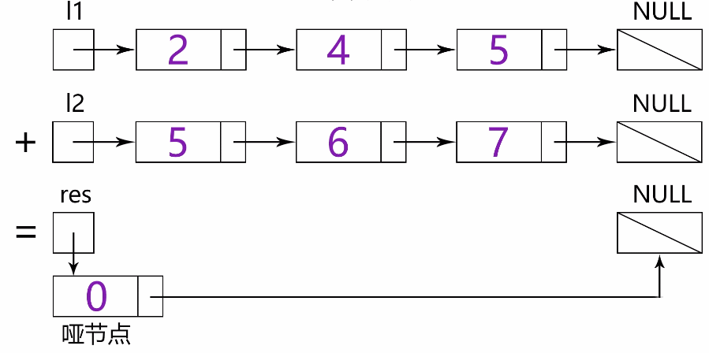

#### [2. 两数相加](https://leetcode-cn.com/problems/add-two-numbers/)

给出两个 非空 的链表用来表示两个非负的整数。其中，它们各自的位数是按照 逆序 的方式存储的，并且它们的每个节点只能存储 一位 数字。

如果，我们将这两个数相加起来，则会返回一个新的链表来表示它们的和。

您可以假设除了数字 0 之外，这两个数都不会以 0 开头。

```
示例：

输入：(2 -> 4 -> 3) + (5 -> 6 -> 4)
输出：7 -> 0 -> 8
原因：342 + 465 = 807
```

**解题思路：**

- 将两个链表看成是相同长度的进行遍历，如果一个链表较短则在前面补 00，比如 987 + 23 = 987 + 023 = 1010
- 每一位计算的同时需要考虑上一位的进位问题，而当前位计算结束后同样需要更新进位值
- 如果两个链表全部遍历完毕后，进位值为 1，则在新链表最前方添加节点 1

- 小技巧：对于链表问题，返回结果为头结点时，通常需要先初始化一个预先指针 dummy，该指针的下一个节点指向真正的头结点head。使用预先指针的目的在于链表初始化时无可用节点值，而且链表构造过程需要指针移动，进而会导致头指针丢失，无法返回结果。

**动画图解：**




```java
/**
 * Definition for singly-linked list.
 * public class ListNode {
 *     int val;
 *     ListNode next;
 *     ListNode(int x) { val = x; }
 * }
 */
class Solution {
    public ListNode addTwoNumbers(ListNode l1, ListNode l2) {
        ListNode p1 = l1;
        ListNode p2 = l2;
        //设置进位
        int carry = 0;
        //设置哑结点
        ListNode dummy = new ListNode(0);
        ListNode curr = dummy;
        while (p1 != null || p2 != null) {
            int x = (p1 != null) ? p1.val : 0;
            int y = (p2 != null) ? p2.val : 0;
            int sum = carry+x+y;
            carry = sum / 10;
            curr.next = new ListNode(sum%10);
            curr = curr.next;
            if (p1 != null) {
                p1 = p1.next;
            }
            if (p2 != null) {
                p2 = p2.next;
            }
        //记录最高位的进位
        if (carry > 0) {
            curr.next = new ListNode(carry);
        }
        }
        return dummy.next;
    }
}
```

> 时间复杂度：O(max(m,n))，其中 m,n 为两个链表的长度。我们要遍历两个链表的全部位置，而处理每个位置只需要 O(1) 的时间。
>
> 空间复杂度：O(max(m,n))。链表的长度最多为较长链表的长度 +1。

