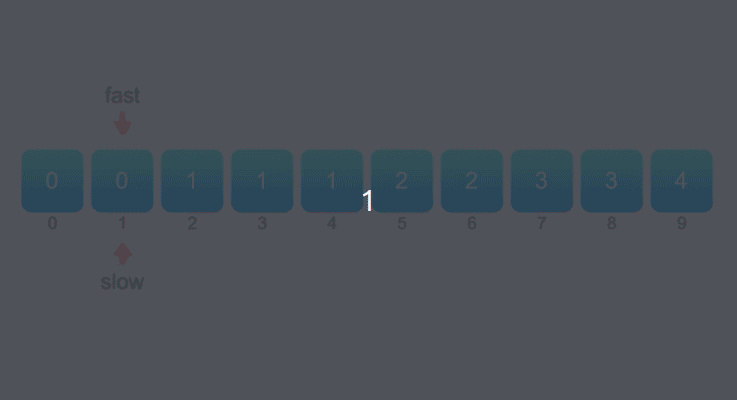

> #### [26. 删除有序数组中的重复项](https://leetcode-cn.com/problems/remove-duplicates-from-sorted-array/)

给你一个有序数组 nums ，请你 原地 删除重复出现的元素，使每个元素 只出现一次 ，返回删除后数组的新长度。

不要使用额外的数组空间，你必须在 原地 修改输入数组 并在使用 O(1) 额外空间的条件下完成。

```
说明:

为什么返回数值是整数，但输出的答案是数组呢?

请注意，输入数组是以「引用」方式传递的，这意味着在函数里修改输入数组对于调用者是可见的。

你可以想象内部操作如下:

// nums 是以“引用”方式传递的。也就是说，不对实参做任何拷贝
int len = removeDuplicates(nums);

// 在函数里修改输入数组对于调用者是可见的。
// 根据你的函数返回的长度, 它会打印出数组中 该长度范围内 的所有元素。
for (int i = 0; i < len; i++) {
    print(nums[i]);
}

示例 1：
输入：nums = [1,1,2]
输出：2, nums = [1,2]
解释：函数应该返回新的长度 2 ，并且原数组 nums 的前两个元素被修改为 1, 2 。不需要考虑数组中超出新长度后面的元素。

示例 2：
输入：nums = [0,0,1,1,1,2,2,3,3,4]
输出：5, nums = [0,1,2,3,4]
解释：函数应该返回新的长度 5 ， 并且原数组 nums 的前五个元素被修改为 0, 1, 2, 3, 4 。不需要考虑数组中超出新长度后面的元素。


提示：
0 <= nums.length <= 3 * 104
-104 <= nums[i] <= 104
nums 已按升序排列
```

#### 解题思路

解法一：双指针法

定义两个指针 fast 和 slow 分别为快指针和慢指针，快指针表示遍历数组到达的下标位置，慢指针表示下一个不同元素要填入的下标位置，初始时两个指针都指向下标 1。

- 假设数组 nums 的长度为 n。将快指针 fast 依次遍历从 1 到 n-1 的每个位置，对于每个位置，如果 nums[fast] != nums[fast−1]，说明 nums[fast] 和之前的元素都不同，因此将nums[fast] 的值复制到 \nums[slow]，然后将 slow 的值加 1，即指向下一个位置。

- 遍历结束之后，从 nums[0] 到 nums[slow−1] 的每个元素都不相同且包含原数组中的每个不同的元素，因此新的长度即为 slow，返回 slow 即可。




**代码演示(Golang)：**

```go
func removeDuplicates(nums []int) int {
	n := len(nums)
	if n == 0 {
        return 0
    }
	slow := 1
	for fast := 1; fast < n; fast++ {
		if nums[fast-1] != nums[fast] {
			nums[slow] = nums[fast]
			slow++
		}
	}
	return slow
}
```

> - 时间复杂度：O(n)，其中 n 是数组的长度。快指针和慢指针最多各移动 n 次。
> - 空间复杂度：O(1)。只需要使用常数的额外空间。