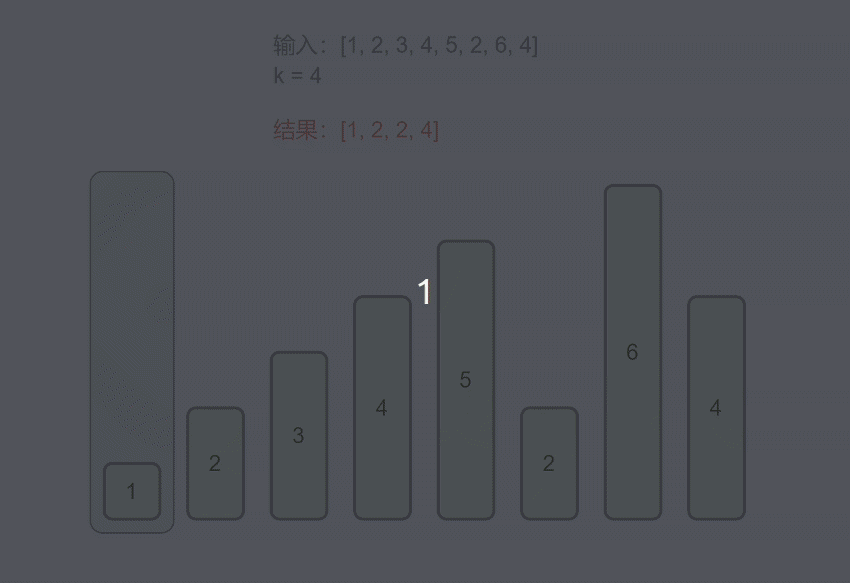

#### [402. 移掉K位数字](https://leetcode-cn.com/problems/remove-k-digits/)

给定一个以字符串表示的非负整数 num，移除这个数中的 k 位数字，使得剩下的数字最小。

注意:

num 的长度小于 10002 且 ≥ k。
num 不会包含任何前导零。

```
示例 1 :

输入: num = "1432219", k = 3
输出: "1219"
解释: 移除掉三个数字 4, 3, 和 2 形成一个新的最小的数字 1219。
示例 2 :

输入: num = "10200", k = 1
输出: "200"
解释: 移掉首位的 1 剩下的数字为 200. 注意输出不能有任何前导零。
示例 3 :

输入: num = "10", k = 2
输出: "0"
解释: 从原数字移除所有的数字，剩余为空就是0。
```

#### 解题思路

对于两个相同长度的数字序列，最左边不同的数字决定了这两个数字的大小，例如，对于A=1axxx，B=1bxxx，如果 a>b 则 A>B。

基于此，我们可以知道，若要使得剩下的数字最小，需要保证靠前的数字尽可能小。

基于上述分析，我们可以得出「删除一个数字」的贪心策略：

给定一个长度为 n 的数字序列 `[D0 D1 D2 D3 …D~n−1~ ]`，从左往右找到第一个位置 i（i>0）使得 D~i~<D~i-1~，并删去 D~i−1~；如果不存在，说明整个数字序列单调不降，删去最后一个数字即可。

基于此，我们可以每次对整个数字序列执行一次这个策略；删去一个字符后，剩下的 n−1 长度的数字序列就形成了新的子问题，可以继续使用同样的策略，直至删除 k 次。

然而暴力的实现复杂度最差会达到 O(nk)（考虑整个数字序列是单调不降的），因此我们需要加速这个过程。

考虑从左往右增量的构造最后的答案。我们可以用一个栈维护当前的答案序列，栈中的元素代表截止到当前位置，删除不超过 k 次个数字后，所能得到的最小整数。根据之前的讨论：在使用 k 个删除次数之前，栈中的序列从栈底到栈顶单调不降。

因此，对于每个数字，如果该数字小于栈顶元素，我们就不断地弹出栈顶元素，直到

- 栈为空
- 或者新的栈顶元素不大于当前数字
- 或者我们已经删除了 k 位数字



上述步骤结束后我们还需要针对一些情况做额外的处理：

- 如果我们删除了 m 个数字且 m<k，这种情况下我们需要从序列尾部删除额外的k−m 个数字。
- 如果最终的数字序列存在前导零，我们要删去前导零。
- 如果最终数字序列为空，我们应该返回 0。

最终，从栈底到栈顶的答案序列即为最小数。

考虑到栈的特点是后进先出，如果通过栈实现，则需要将栈内元素依次弹出然后进行翻转才能得到最小数。**为了避免翻转操作**，可以使用双端队列代替栈的实现。

```java
class Solution {
    public int[] maxNumber(int[] nums1, int[] nums2, int k) {
        int m = 0, n = 0;
        if(nums1 == null || (m = nums1.length) == 0)    return maxNumberK(nums2, k);
        if(nums2 == null || (n = nums2.length) == 0)    return maxNumberK(nums1, k);
        /*
            0 <= i <= m
            0 <= k-i <= n  ==> k-n <= i <= k
        ==> Math.max(0, k-n) <= i <= Math.min(m, k)
        */
        int[] res = null;
        for(int i = Math.max(0, k-n), limit = Math.min(m, k); i <= limit; i++){
            int[] a = maxNumberK(nums1, i);
            int[] b = maxNumberK(nums2, k-i);
            int[] c = merge(a, b);
            res = res == null || compare(res, 0, c, 0) < 0 ? c : res;
        }

        return res;
    }

    // 单调栈 求 nums 中 长度为 k 的最大数
    // 问题转化为 移除 nums 中 n-k 个元素 LeetCode 402
    // nums != null         0 <= k <= nums.length
    private int[] maxNumberK(int[] nums, int k){
        int n = nums.length;
        k = n - k; // 移除 n-k 个
        if(k == 0)  return nums.clone();
        if(k == n)  return new int[0];

        int[] stack = new int[n];
        int top = 0;
        for(int i=0; i<n; i++){
            // 如果堆栈非空，且当前元素 比 栈顶元素 大，移除 栈顶元素
            while(k > 0 && top > 0 && nums[i] > stack[top-1]){
                top--;
                k--;
            }
            stack[top++] = nums[i]; // 当前元素 入栈
        }

        top -= k; // 如果 k > 0, 再移除 k 个 栈顶元素

        return Arrays.copyOfRange(stack, 0, top);
    }

    // 合并两个数组 成 最大值
    // nums1 != null && nums2 != null
    private int[] merge(int[] nums1, int[] nums2){
        int m = nums1.length;
        int n = nums2.length;

        int[] res = new int[m+n];
        int i = 0, j = 0, k = 0;
        while(i < m && j < n){
            res[k++] = compare(nums1, i, nums2, j) >= 0 ? nums1[i++] : nums2[j++];
        }
        while(i < m){
            res[k++] = nums1[i++];
        }
        while(j < n){
            res[k++] = nums2[j++];
        }

        return res;
    }

    // 比较 nums1[i,m)  和 nums2[j, n)
    // nums1 != null && nums2 != null
    private int compare(int[] nums1, int i, int[] nums2, int j){
        int m = nums1.length;
        int n = nums2.length;

        for(int k=0, limit = Math.min(m-i, n-j); k < limit; k++){
            if(nums1[i + k] != nums2[j + k])    return Integer.compare(nums1[i + k], nums2[j + k]);
        }

        return Integer.compare(m - i, n - j); 
    }
}
```

> 时间复杂度：O(k(m+n+k^2^))，其中 m 和 n 分别是数组 `nums 
> 1`和 `nums2`的长度，k 是拼接最大数的长度。
> 两个子序列的长度之和为 k，最多有 k 种不同的长度组合。对于每一种长度组合，需要首先得到两个最大子序列，然后进行合并。
> 得到两个最大子序列的时间复杂度为线性，即 O(m+n)。
> 合并两个最大子序列，需要进行 k 次合并，每次合并需要进行比较，最坏情况下，比较的时间复杂度为 O(k)，因此合并操作的时间复杂度为 O(k^2)^。
> 因此对于每一种长度组合，时间复杂度为 O(m+n+k^2^)，总时间复杂度为 O(k(m+n+k^2^))。
>
> 空间复杂度：O(k)，其中 k 是拼接最大数的长度。每次从两个数组得到两个子序列，两个子序列的长度之和为 k。
>