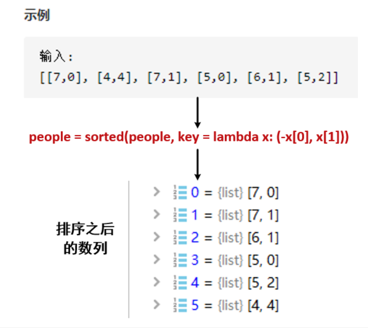

#### [406. 根据身高重建队列](https://leetcode-cn.com/problems/queue-reconstruction-by-height/)

假设有打乱顺序的一群人站成一个队列。 每个人由一个整数对(h, k)表示，其中h是这个人的身高，k是排在这个人前面且身高大于或等于h的人数。 编写一个算法来重建这个队列。

注意：
总人数少于1100人。

示例

```
输入:
[[7,0], [4,4], [7,1], [5,0], [6,1], [5,2]]

输出:
[[5,0], [7,0], [5,2], [6,1], [4,4], [7,1]]
```

#### 解题思路

1. **根据第一个元素降序排序，根据第二个元素升序排序**



2. 排序后进行插入，因为二维数组第二个元素在排序后应该为相对位置，所以应该判断已排序的res个数与当前的相对位置大小关系。如当`res.length > [x[0], x[1]]中的x[1]`时，即插入到x[1]的位置。


```java
import java.util.Arrays;
import java.util.LinkedList;

class Solution {
    public int[][] reconstructQueue(int[][] people) {
        //先对people的第一列降序排序，再对第二列升序排列
        //如[7,0], [7,1], [6,1], [5,0], [5,2], [4,4]
        //Arrays.sort默认升序，实现降序需要实现自定义的Comparator，并重写其中的Compare()
        //使用java8的Lambda表达式可以通过表达式来代替功能接口，等价于下列代码
//        Arrays.sort(people, new Comparator<int[]>() {
//            @Override
//            public int compare(int[] o1, int[] o2) {
//                return o1[0] == o2[0] ? o1[1] - o2[1] : o2[0] - o1[0];
//            }
//        });
        Arrays.sort(people,(o1, o2) -> o1[0] == o2[0] ? o1[1] - o2[1] : o2[0] - o1[0]);

        LinkedList<int[]> list = new LinkedList<>();
        for(int[] index : people) {
            //先排序后插入，people第二列应该为res的位置
            list.add(index[1],index);
        }
        int[][] res = new int[list.size()][2];
        return list.toArray(res);
    }
}
```

> 时间复杂度：O(n^2^ )，其中 n 是数组 people 的长度。我们需要(nlogn) 的时间进行排序，随后需要 O(n^2^)的时间遍历每一个人并将他们放入队列中。由于前者在渐近意义下小于后者，因此总时间复杂度为 O(n^2^)。
>
> 空间复杂度：O(logn)。
>