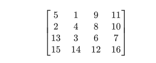
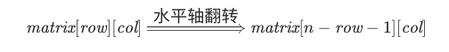
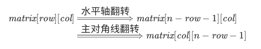

#### [48. 旋转图像](https://leetcode-cn.com/problems/rotate-image/)

给定一个 n × n 的二维矩阵表示一个图像。

将图像顺时针旋转 90 度。

说明：

你必须在原地旋转图像，这意味着你需要直接修改输入的二维矩阵。请不要使用另一个矩阵来旋转图像。

```
示例 1:

给定 matrix = 
[
  [1,2,3],
  [4,5,6],
  [7,8,9]
],

原地旋转输入矩阵，使其变为:
[
  [7,4,1],
  [8,5,2],
  [9,6,3]
]
示例 2:

给定 matrix =
[
  [ 5, 1, 9,11],
  [ 2, 4, 8,10],
  [13, 3, 6, 7],
  [15,14,12,16]
], 

原地旋转输入矩阵，使其变为:
[
  [15,13, 2, 5],
  [14, 3, 4, 1],
  [12, 6, 8, 9],
  [16, 7,10,11]
]
```

#### 解题思路（上下＋对角线翻转）

用翻转操作代替旋转操作。我们以题目中的示例二作为例子，



先将其通过水平轴翻转得到：


再根据主对角线翻转得到：


就得到了答案。这是为什么呢？对于水平轴翻转而言，我们只需要枚举矩阵上半部分的元素，和下半部分的元素进行交换，即



对于主对角线翻转而言，我们只需要枚举对角线左侧的元素，和右侧的元素进行交换，即


将它们联立即可得到：



**代码演示（Golang）**

```go
func rotate(matrix [][]int) {
    n := len(matrix)
    // 水平翻转
    for i := 0; i < n/2; i++ {
        matrix[i], matrix[n-1-i] = matrix[n-1-i], matrix[i]
    }
    // 主对角线翻转
    for i := 0; i < n; i++ {
        for j := 0; j < i; j++ {
            matrix[i][j], matrix[j][i] = matrix[j][i], matrix[i][j]
        }
    }
}
```

> 时间复杂度：O(N<sup>2</sup>)，其中 N 是 matrix 的边长。对于每一次翻转操作，我们都需要枚举矩阵中一半的元素。
>
> 空间复杂度：O(1)。为原地翻转得到的原地旋转。
>

