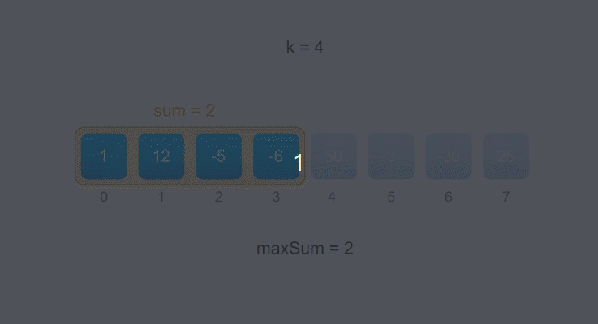

#### [643. 子数组最大平均数 I](https://leetcode-cn.com/problems/maximum-average-subarray-i/)

给定 n 个整数，找出平均数最大且长度为 k 的连续子数组，并输出该最大平均数。 

```
示例：

输入：[1,12,-5,-6,50,3], k = 4
输出：12.75
解释：最大平均数 (12-5-6+50)/4 = 51/4 = 12.75


提示：

1 <= k <= n <= 30,000。
所给数据范围 [-10,000，10,000]。
```

#### 解题思路（滑动窗口）

- 初始先对窗口中的K个元素求和sum。
- 然后窗口向右滑动，加上从右边进入窗口的值，减去从左边退出窗口的值。
- 在整个滑动过程中，记录元素和的最大值`maxSum`，最后再求平均值。

**动画图解：**



**代码演示（Golang）**

```go
func findMaxAverage(nums []int, k int) float64 {
	sum := 0
	window := make([]int, k)
	for i := 0 ; i < k ; i++ {
		window[i] = nums[i]
		sum += window[i]
	}

	maxSum := sum
	for j := k; j < len(nums); j++ {
		sum = sum - nums[j-k] + nums[j]
		maxSum = max(maxSum, sum)
	}
	
	return float64(maxSum) / float64(k)
}

func max(a, b int) int {
	if a > b {
		return a
	}
	return b
}
```

> 时间复杂度：O(n)，其中 n是数组 nums 的长度。遍历数组一次。
>
> 空间复杂度：O(1)。