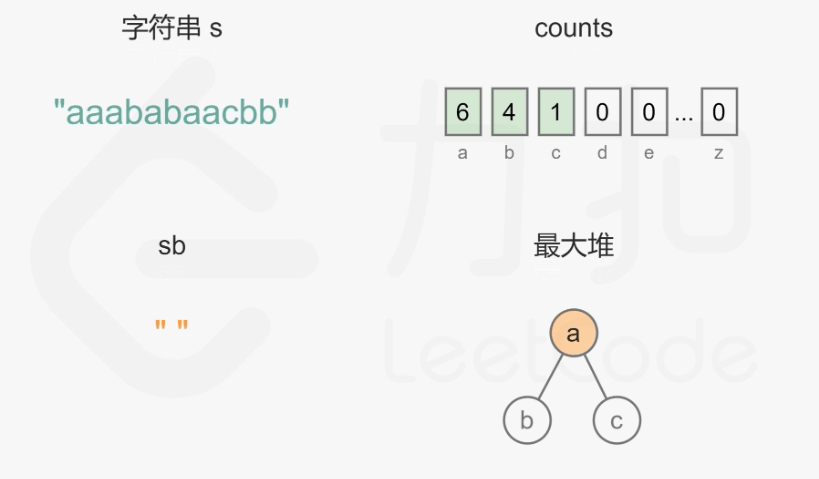

#### [767. 重构字符串](https://leetcode-cn.com/problems/reorganize-string/)

给定一个字符串S，检查是否能重新排布其中的字母，使得两相邻的字符不同。

若可行，输出任意可行的结果。若不可行，返回空字符串。

```
示例 1:

输入: S = "aab"
输出: "aba"
示例 2:

输入: S = "aaab"
输出: ""
注意:

S 只包含小写字母并且长度在[1, 500]区间内。
```

#### 解题思路

这道题是典型的贪心算法的题，在处理问题之前可以进行剪枝操作。

1. 首先遍历字符串并统计每个字母的出现次数，如果存在一个字母的出现次数大于 `(n+1)/2`，则无法重新排布字母使得相邻的字母都不相同，返回空字符串。如果所有字母的出现次数都不超过`(n+1)/2`，则考虑如何重新排布字母。
2. 使用`PriorityQueue`维护最大堆存储字母，堆顶元素为出现次数最多的字母。
   - 首先新建`count`数组统计每个字母的出现次数
   - 然后将出现次数大于 0 的字母加入最大堆queue
   - 当最大堆的元素个数大于 1 时，每次从最大堆取出两个字母，拼接到重构的字符串，然后将两个字母的出现次数分别减 1，并将剩余出现次数大于 0 的字母重新加入最大堆
   - 如果最大堆变成空，则已经完成字符串的重构。如果最大堆剩下 1 个元素，则取出最后一个字母，拼接到重构的字符串。

**动画图示：**



**代码演示：**

```java
import java.util.Comparator;
import java.util.PriorityQueue;

class Solution {
    public String reorganizeString(String S) {
        int[] count = new int[26];
        char[] chars = S.toCharArray();
        int maxCount = 0;
        //构造字符频次数组
        for (char ch : chars) {
            count[ch - 'a']++;
            maxCount = Math.max(maxCount, count[ch - 'a']);
        }
        //原则上大于S.length一半的时候返回，注意当有奇数个元素的情况，所以应该写成maxCount > (S.length()+1)/2
        if (maxCount > (S.length()+1)/2) return "";
        //优先队列默认实现小根堆，需要重写compare实现大根堆
        PriorityQueue<Character> queue = new PriorityQueue<>(new Comparator<Character>() {
            @Override
            public int compare(Character o1, Character o2) {
                return count[o2 - 'a'] - count[o1 - 'a'];
            }
        });
        for (char i = 'a'; i <= 'z'; i++) {
            if (count[i - 'a'] > 0) {
                //queue反应在S添加到sb过程中，未添加到sb的各个字符出现情况
                queue.offer(i);
            }
        }
        StringBuffer sb = new StringBuffer();
        while (queue.size() > 1) {
            char letter1 = queue.poll();
            char letter2 = queue.poll();
            sb.append(letter1);
            sb.append(letter2);
            count[letter1 - 'a']--;
            count[letter2 - 'a']--;
            //判断是否还有该字符，如有要重新添加到queue中
            if (count[letter1 - 'a'] > 0) {
                queue.offer(letter1);
            }
            if (count[letter2 - 'a'] > 0) {
                queue.offer(letter2);
            }
        }
        //单独讨论最后只剩一个字符的时候，添加到sb末尾即可
        if (queue.size() == 1) {
            sb.append(queue.poll());
        }
        return sb.toString();
    }
}
```

> 时间复杂度：`O(n log∣Σ∣+∣Σ∣)`，其中 n 是字符串的长度，Σ 是字符集，在本题中字符集为所有小写字母，`∣Σ∣=26`。
> 遍历字符串并统计每个字母的出现次数，时间复杂度是 `O(n)`。
> 将每个字母加入最大堆，字母个数最多为 `∣Σ∣`，这里设真正出现的小写字母数量为`∣Σ ′∣`，那么时间复杂度是 `O(∣Σ∣) `加上 `O(∣Σ 
> ′∣log∣Σ ′∣) 或 O(∣Σ ′∣)`。前者是对数组进行遍历的时间复杂度 `O(∣Σ∣)`，而后者取决于是将每个字母依次加入最大堆，时间复杂度为 O(∣Σ ′∣log∣Σ ′∣)；还是直接使用一次堆的初始化操作，时间复杂度为` O(∣Σ ′∣)`。
> 重构字符串需要对最大堆进行取出元素和添加元素的操作，取出元素和添加元素的次数都不会超过 n 次，每次操作的时间复杂度是 `O(log∣Σ ′∣)`，因此总时间复杂度是 `O(n log∣Σ ′∣)`。由于真正出现的小写字母数量为`∣Σ ′∣` 一定小于等于字符串的长度 n，因此上面的时间复杂度中 `O(n)`，`O(∣Σ ′∣log∣Σ ′∣)` 和 `O(∣Σ ′∣)` 在渐进意义下均小于` O(n log∣Σ ′∣)`，只需要保留`O(∣Σ∣)`。由于`∣Σ ′∣≤∣Σ∣`，为了不引入额外符号，可以将时间复杂度`O(n log∣Σ ′∣) `写成 `O(n log∣Σ∣)`。总时间复杂度是`O(n log∣Σ∣+∣Σ∣)`。
>
> 空间复杂度：`O(∣Σ∣)`，其中 Σ 是字符集，在本题中字符集为所有小写字母，`∣Σ∣=26`。这里不计算存储最终答案字符串需要的空间（以及由于语言特性，在构造字符串时需要的额外缓存空间），空间复杂度主要取决于统计每个字母出现次数的数组和优先队列。
>

