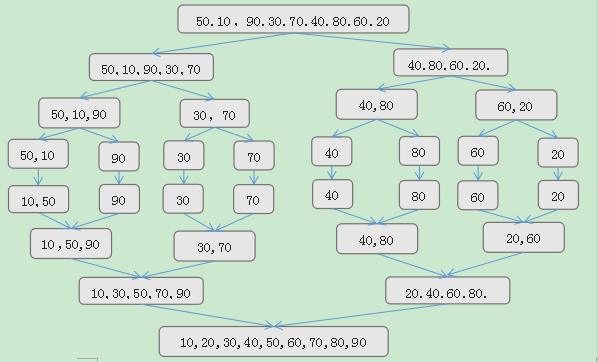

## 排序算法总结


### 十大常见算法分类：

- **比较类排序**：通过比较来决定元素间的相对次序，由于其时间复杂度不能突破O(nlogn)，因此也称为非线性时间比较类排序。
- **非比较类排序**：不通过比较来决定元素间的相对次序，通过确定每个元素之前，应该有多少个元素来排序。针对数组arr，计算arr[i]之前有多少个元素，则唯一确定了arr[i]在排序后数组中的位置。它可以突破基于比较排序的时间下界，以线性时间运行，因此也称为线性时间非比较类排序。 


#### 算法时间复杂度及其稳定性总结


**稳定性概念解释：**

- **稳定**：如果a原本在b前面，而a=b，排序之后a仍然在b的前面。
- **不稳定**：如果a原本在b的前面，而a=b，排序之后 a 可能会出现在 b 的后面。


#### 1. 冒泡排序（Bubble Sort）

​	冒泡排序是一种简单的排序算法。它重复地走访过要排序的数列，一次比较两个元素，如果它们的顺序错误就把它们交换过来。走访数列的工作是重复地进行直到没有再需要交换，也就是说该数列已经排序完成。这个算法的名字由来是因为越小的元素会经由交换慢慢“浮”到数列的顶端。 


**1.1 算法描述**

- 比较相邻的元素。如果第一个比第二个大，就交换它们两个；
- 对每一对相邻元素作同样的工作，从开始第一对到结尾的最后一对，这样在最后的元素应该会是最大的数；
- 针对所有的元素重复以上的步骤，除了最后一个；
- 重复步骤1~3，直到排序完成。


**1.2 动图演示**


**1.3 代码实现**

```java
    /**
     * 冒泡排序
     */
    public static int[] bubbleSort(int[] array) {
        if (array.length == 0)
            return array;
        for (int i = 0; i < array.length; i++)
            for (int j = 0; j < array.length - 1 - i; j++)
                if (array[j + 1] < array[j]) {
                    int temp = array[j + 1];
                    array[j + 1] = array[j];
                    array[j] = temp;
                }
        return array;
    }
```


**1.4 算法分析**

> - 最佳情况：T(n) = O(n)  
> - 最差情况：T(n) = O(n<sup>2</sup>)  
> - 平均情况：T(n) = O(n<sup>2</sup>)


#### 2、选择排序（Selection Sort）

​	选择排序(Selection-sort)是一种简单直观的排序算法。表现**最稳定的排序算法之一**，因为**无论什么数据进去都是O(n2)的时间复杂度**。它的工作原理：首先在未排序序列中找到最小（大）元素，存放到排序序列的起始位置，然后，再从剩余未排序元素中继续寻找最小（大）元素，然后放到已排序序列的末尾。以此类推，直到所有元素均排序完毕。


**2.1 算法描述**

n个记录的直接选择排序可经过n-1趟直接选择排序得到有序结果。具体算法描述如下：

- 初始状态：无序区为R[1..n]，有序区为空；
- 第i趟排序(i=1,2,3…n-1)开始时，当前有序区和无序区分别为`R[1..i-1]`和`R(i..n）`。该趟排序从当前无序区中-选出关键字最小的记录 R[k]，将它与无序区的第1个记录R交换，使`R[1..i]`和`R[i+1..n)`分别变为记录个数增加1个的新有序区和记录个数减少1个的新无序区；
- n-1趟结束，数组有序化了。


**2.2 动图演示**

　　


**2.3 代码实现**

```java
	/**
     * 选择排序
     */
    public static int[] selectionSort(int[] array) {
        if (array.length == 0)
            return array;
        for (int i = 0; i < array.length; i++) {
            int minIndex = i;
            for (int j = i; j < array.length; j++) {
                if (array[j] < array[minIndex]) //找到最小的数
                    minIndex = j; //将最小数的索引保存
            }
            int temp = array[minIndex];
            array[minIndex] = array[i];
            array[i] = temp;
        }
        return array;
    }
```


**2.4 算法分析**

> - 最佳情况：T(n) = O(n<sup>2</sup>)  
> - 最差情况：T(n) = O(n<sup>2</sup>)  
> - 平均情况：T(n) = O(n<sup>2</sup>)


#### 3、插入排序（Insertion Sort）

插入排序（Insertion-Sort）的算法描述是一种简单直观的排序算法。它的工作原理是通过构建有序序列，对于未排序数据，在已排序序列中从后向前扫描，找到相应位置并插入。插入排序在实现上，通常采用in-place排序（即只需用到O(1)的额外空间的排序），因而在从后向前扫描过程中，需要反复把已排序元素逐步向后挪位，为最新元素提供插入空间。


**3.1 算法描述**

一般来说，插入排序都采用in-place在数组上实现。具体算法描述如下：

- 从第一个元素开始，该元素可以认为已经被排序；
- 取出下一个元素，在已经排序的元素序列中从后向前扫描；
- 如果该元素（已排序）大于新元素，将该元素移到下一位置；
- 重复步骤3，直到找到已排序的元素小于或者等于新元素的位置；
- 将新元素插入到该位置后；
- 重复步骤2~5。


**3.2 动图演示**


**3.3 代码实现**

```Java
　　/**
     * 插入排序
     */
    public static int[] insertionSort(int[] array) {
        if (array.length == 0)
            return array;
        int current;
        for (int i = 0; i < array.length - 1; i++) {
            current = array[i + 1];
            int preIndex = i;
            while (preIndex >= 0 && current < array[preIndex]) {
                array[preIndex + 1] = array[preIndex];
                preIndex--;
            }
            array[preIndex + 1] = current;
        }
        return array;
    }
```


**3.4 算法分析**

> - 最佳情况：T(n) = O(n)  
> - 最差情况：T(n) = O(n<sup>2</sup>)  
> - 平均情况：T(n) = O(n<sup>2</sup>)


#### 4、希尔排序（Shell Sort）

希尔排序是希尔（Donald Shell）于1959年提出的一种排序算法。**希尔排序也是一种插入排序**，它是简单插入排序经过改进之后的一个更高效的版本，也称为**缩小增量排序**，同时该算法是冲破O(n<sup>2</sup>）的第一批算法之一。它与插入排序的不同之处在于，它会优先比较距离较远的元素。希尔排序又叫缩小增量排序。

**希尔排序是把记录按表的一定增量分组，对每组使用直接插入排序算法排序；随着增量逐渐减少，每组包含的关键词越来越多，当增量减至1时，整个文件恰被分成一组，算法便终止。**


**4.1 算法描述**

我们来看下希尔排序的基本步骤，在此我们选择增量gap=length/2，缩小增量继续以gap = gap/2的方式，这种增量选择我们可以用一个序列来表示，**{n/2,(n/2)/2...1}**，称为**增量序列**。希尔排序的增量序列的选择与证明是个数学难题，我们选择的这个增量序列是比较常用的，也是希尔建议的增量，称为希尔增量，但其实这个增量序列不是最优的。此处我们做示例使用希尔增量。

先将整个待排序的记录序列分割成为若干子序列分别进行直接插入排序，具体算法描述：

- 选择一个增量序列t~1~，t~2~，…，t~k~，其中t~i~ > t~j~，t~k~=1；
- 按增量序列个数k，对序列进行k 趟排序；
- 每趟排序，根据对应的增量t~i~，将待排序列分割成若干长度为m 的子序列，分别对各子表进行直接插入排序。仅增量因子为1 时，整个序列作为一个表来处理，表长度即为整个序列的长度。


**4.2 过程演示**


****


**4.3 代码实现**

```java
    /**
     * 希尔排序
     */
    public static int[] ShellSort(int[] array) {
        int len = array.length;
        int temp, gap = len / 2;
        while (gap > 0) {
            for (int i = gap; i < len; i++) {
                temp = array[i];
                //倒序，分组的最后一个元素开始
                int preIndex = i - gap;
                //有preIndex目的是：当gap较小是，一个组可能有多个
                // 所以以preIndex >= 0为指标对组内所有元素排序
                //array[preIndex] > temp：当数组前面index较大时swap
                while (preIndex >= 0 && array[preIndex] > temp) {
                    //交换使升序
                    array[preIndex + gap] = array[preIndex];
                    //index倒序向前
                    preIndex -= gap;
                }
                //当发生大小交换时，这是swap的后续处理步骤
                //当没有swap时，相当于没有操作
                array[preIndex + gap] = temp;
            }
            gap /= 2;
        }
        return array;
    }
```


**4.4 算法分析**

​	希尔排序的时间复杂度与增量(即，步长gap)的选取有关。例如，当增量为1时，希尔排序退化成了直接插入排序，此时的时间复杂度为O(N²)，而Hibbard增量的希尔排序的时间复杂度为O(N<sup>3/2</sup>)。

> - 最佳情况：T(n) = O(n)  
> - 最差情况：T(n) = O(n<sup>2</sup>)  
> - 平均情况：T(n) = O(n<sup>1.3</sup>): 比O(n<sup>2</sup>)  要好，但是比O(n log n)差


#### 5、归并排序（Merge Sort）

​	和选择排序一样，归并排序的性能不受输入数据的影响，但表现比选择排序好的多，因为始终都是O(n log n）的时间复杂度。代价是需要额外的内存空间。

​	归并排序是建立在归并操作上的一种有效的排序算法。该算法是采用分治法（Divide and Conquer）的一个非常典型的应用。归并排序是一种稳定的排序方法。将已有序的子序列合并，得到完全有序的序列；即先使每个子序列有序，再使子序列段间有序。若将两个有序表合并成一个有序表，称为2-路归并。 


**5.1 算法描述**

- 把长度为n的输入序列分成两个长度为n/2的子序列；
- 对这两个子序列分别采用归并排序；
- 将两个排序好的子序列合并成一个最终的排序序列。

以数组{50,10,90,30,70,40,80,60,20}为例，



最后的排序结果：
10,20,30,40,50,60,70,80,90


**5.2 动图演示**


**5.3 代码实现**

递归：

```java
　　/**
     * 归并排序
     */
    public static void MergeSort(int[] arr, int low, int high) {
        //使用递归的方式进行归并排序，所需要的空间复杂度是O（N+logN）
        int mid = (low + high)/2;
        if(low < high)
        {
            //递归地对左右两边进行排序
            MergeSort(arr, low, mid);
            MergeSort(arr, mid+1, high);
            //合并
            merge(arr, low, mid, high);
        }
    }

    //merge函数实际上是将两个有序数组合并成一个有序数组
    //因为数组有序，合并很简单，只要维护几个指针就可以了
    private static void merge(int[] arr, int low, int mid, int high)
    {
        //temp数组用于暂存合并的结果
        int[] temp = new int[high - low + 1];
        //左半边的指针
        int i = low;
        //右半边的指针
        int j = mid+1;
        //合并后数组的指针
        int k = 0;

        //将记录由小到大地放进temp数组
        for(; i <= mid && j <= high; k++)
        {
            if(arr[i] < arr[j])
                temp[k] = arr[i++];
            else
                temp[k] = arr[j++];
        }

        //接下来两个while循环是为了将剩余的（比另一边多出来的个数）放到temp数组中
        while(i <= mid)
            temp[k++] = arr[i++];

        while(j <= high)
            temp[k++] = arr[j++];

        //将temp数组中的元素写入到待排数组中
        for(int l = 0; l < temp.length; l++)
            arr[low + l] = temp[l];
    }

```

迭代：

​	**但是,**使用递归的归并排序需要深度为log n的栈空间，虽然代码很简单易懂，但是会造成时间和空间上的性能损耗，为了优化归并排序，我们可以使用迭代代替递归。非递归而是迭代的归并排序很直观，就是从前往后从最小的序列开始归并，直到完成即可。

```java
package com.yenghye.sort;

public class Sort {

    public static void MergeSort2(int[] arr)
    {
        //使用非递归的方式来实现归并排序
        int len = arr.length;
        int k = 1;
        
        while(k < len)
        {
            MergePass(arr, k, len);
            k *= 2;         
        }
    }
    
    //MergePass方法负责将数组中的相邻的有k个元素的字序列进行归并
    private static void MergePass(int[] arr, int k, int n)
    {
        int i = 0;
        int j;
        
        //从前往后,将2个长度为k的子序列合并为1个
        while(i < n - 2*k + 1)
        {
            merge(arr, i, i + k-1, i + 2*k - 1);
            i += 2*k;
        }
        
        //这段代码保证了，将那些“落单的”长度不足两两merge的部分和前面merge起来。
        if(i < n - k )
        {
            merge(arr, i, i+k-1, n-1);
        }
        
    }
    
    //merge函数实际上是将两个有序数组合并成一个有序数组
    //因为数组有序，合并很简单，只要维护几个指针就可以了
    private static void merge(int[] arr, int low, int mid, int high)
    {
        //temp数组用于暂存合并的结果
        int[] temp = new int[high - low + 1];
        //左半边的指针
        int i = low;
        //右半边的指针
        int j = mid+1;
        //合并后数组的指针
        int k = 0;
        
        //将记录由小到大地放进temp数组
        for(; i <= mid && j <= high; k++)
        {
            if(arr[i] < arr[j])
                temp[k] = arr[i++];
            else
                temp[k] = arr[j++];
        }
        
        //接下来两个while循环是为了将剩余的（比另一边多出来的个数）放到temp数组中
        while(i <= mid)
            temp[k++] = arr[i++];
        
        while(j <= high)
            temp[k++] = arr[j++];
        
        //将temp数组中的元素写入到待排数组中
        for(int l = 0; l < temp.length; l++)
            arr[low + l] = temp[l];
    }
}
```

**5. 4 算法分析**

> - 最佳情况：T(n) = O(n)
> - 最差情况：T(n) = O(n log n)
> - 平均情况：T(n) = O(n log n)
> - 空间复杂度：递归：O(n + log n)， 非递归：O(n)


### 6、快速排序（Quick Sort）

快速排序的基本思想：通过一趟排序将待排记录分隔成独立的两部分，其中一部分记录的关键字均比另一部分的关键字小，则可分别对这两部分记录继续进行排序，以达到整个序列有序。


**6.1 算法描述**

快速排序使用分治法来把一个串（list）分为两个子串（sub-lists）。具体算法描述如下：

- 从数列中挑出一个元素，称为 “基准”（**pivot**）；
- 重新排序数列，所有元素比基准值小的摆放在基准前面，所有元素比基准值大的摆在基准的后面（相同的数可以到任一边）。在这个分区退出之后，该基准就处于数列的中间位置。这个称为分区（partition）操作；
- 递归地（recursive）把小于基准值元素的子数列和大于基准值元素的子数列排序。


**6.2 动图演示**


**6.3 代码实现**

```java
    /**
     * 快速排序
     */
    private static void quickSort(int[] arr, int low, int high){
        if (low >= high)
            return;
        int pivot = partition(arr, low, high);        //将数组分为两部分
        quickSort(arr, low, pivot-1);                   //递归排序左子数组
        quickSort(arr, pivot+1, high);                  //递归排序右子数组
    }
    private static int partition(int[] arr, int low, int high){
        int pivot = arr[low];     //基准
        while (low < high){
            while (low < high && arr[high] >= pivot) --high;
            arr[low]=arr[high];             //交换比基准大的记录到左端
            while (low < high && arr[low] <= pivot) ++low;
            arr[high] = arr[low];           //交换比基准小的记录到右端
        }
        //扫描完成，基准到位
        arr[low] = pivot;
        //返回的是基准的位置
        return low;
    }
```


**6.4 算法分析**

> - 最佳情况：T(n) =  O(n log n)
> - 最差情况：T(n) = O(n<sup>2</sup>)
> - 平均情况：T(n) = O(n log n)
> - 空间复杂度：递归：O(log n)


#### 7、堆排序（Heap Sort）

堆排序（Heapsort）是指利用堆这种数据结构所设计的一种排序算法。堆积是一个近似完全二叉树的结构，并同时满足堆积的性质：即子结点的键值或索引总是小于（或者大于）它的父节点。


**7.1 算法描述**

- 将初始待排序关键字序列(R~1~,R~2~….R~n~)构建成大顶堆，此堆为初始的无序区；
- 将堆顶元素R[1]与最后一个元素R[n]交换，此时得到新的无序区(R~1~,R~2~….R~n-1~)和新的有序区(R~n~),且满足`R[1,2…n-1]<=R[n]`；
- 由于交换后新的堆顶R[1]可能违反堆的性质，因此需要对当前无序区(R~1~,R~2~….R~n-1~)调整为新堆，然后再次将R[1]与无序区最后一个元素交换，得到新的无序区(R~1~,R~2~….R~n-2~)和新的有序区(R~n-1~,R~n~)。不断重复此过程直到有序区的元素个数为n-1，则整个排序过程完成。


**7.2 动图演示**


**7.3 代码实现**

注意：这里用到了完全二叉树的部分性质：详情见[《数据结构二叉树知识点总结》](http://www.cnblogs.com/guoyaohua/p/8595289.html)

```java
//声明全局变量，用于记录数组array的长度；
static int len;
    /**
     * 堆排序算法
     */
    public static int[] HeapSort(int[] array) {
        len = array.length;
        if (len < 1) return array;
        //1.构建一个最大堆
        buildMaxHeap(array);
        //2.循环将堆首位（最大值）与末位交换，然后在重新调整最大堆
        while (len > 0) {
            swap(array, 0, len - 1);
            len--;
            adjustHeap(array, 0);
        }
        return array;
    }
    /**
     * 建立最大堆
     */
    public static void buildMaxHeap(int[] array) {
        //从最后一个非叶子节点开始向上构造最大堆
        for (int i = (len/2 - 1); i >= 0; i--) { //感谢 @让我发会呆 网友的提醒，此处应该为 i = (len/2 - 1) 
            adjustHeap(array, i);
        }
    }
    /**
     * 调整使之成为最大堆
     */
    public static void adjustHeap(int[] array, int i) {
        int maxIndex = i;
        //如果有左子树，且左子树大于父节点，则将最大指针指向左子树
        if (i * 2 < len && array[i * 2] > array[maxIndex])
            maxIndex = i * 2;
        //如果有右子树，且右子树大于父节点，则将最大指针指向右子树
        if (i * 2 + 1 < len && array[i * 2 + 1] > array[maxIndex])
            maxIndex = i * 2 + 1;
        //如果父节点不是最大值，则将父节点与最大值交换，并且递归调整与父节点交换的位置。
        if (maxIndex != i) {
            swap(array, maxIndex, i);
            adjustHeap(array, maxIndex);
        }
    }
```


**7.4 算法分析**

> - 最佳情况：T(n) =  O(n log n)
> - 最差情况：T(n) = O(n log n)
> - 平均情况：T(n) = O(n log n)
> - 空间复杂度：O(1)


#### 8、计数排序（Counting Sort）

​	计数排序的核心在于将输入的数据值转化为键存储在额外开辟的数组空间中。 作为一种线性时间复杂度的排序，计数排序要求输入的数据必须是有确定范围的整数。

​	计数排序(Counting sort)是一种稳定的排序算法。计数排序使用一个额外的数组C，其中第i个元素是待排序数组A中值等于i的元素的个数。然后根据数组C来将A中的元素排到正确的位置。它只能对整数进行排序。


**8.1 算法描述**

- 找出待排序的数组中最大和最小的元素；
- 统计数组中每个值为i的元素出现的次数，存入数组C的第i项；
- 对所有的计数累加（从C中的第一个元素开始，每一项和前一项相加）；
- 反向填充目标数组：将每个元素i放在新数组的第C(i)项，每放一个元素就将C(i)减去1。


**8.2 动图演示**


**8.3 代码实现**

```java
	/**
     * 计数排序
     */
    public static int[] CountingSort(int[] array) {
        if (array.length == 0) return array;
        int bias, min = array[0], max = array[0];
        for (int i = 1; i < array.length; i++) {
            if (array[i] > max)
                max = array[i];
            if (array[i] < min)
                min = array[i];
        }
        bias = 0 - min;
        int[] bucket = new int[max - min + 1];
        Arrays.fill(bucket, 0);
        for (int i = 0; i < array.length; i++) {
            bucket[array[i] + bias]++;
        }
        int index = 0, i = 0;
        while (index < array.length) {
            if (bucket[i] != 0) {
                array[index] = i - bias;
                bucket[i]--;
                index++;
            } else
                i++;
        }
        return array;
    }
```


**8.4 算法分析**

当输入的元素是n 个0到k之间的整数时，它的运行时间是 O(n + k)。计数排序不是比较排序，排序的速度快于任何比较排序算法。由于用来计数的数组C的长度取决于待排序数组中数据的范围（等于待排序数组的最大值与最小值的差加上1），这使得计数排序对于数据范围很大的数组，需要大量时间和内存。

> - 最佳情况：T(n) = O(n+k)
> - 最差情况：T(n) = O(n+k)
> - 平均情况：T(n) = O(n+k)
> - 空间复杂度：O(n+k)


#### 9、桶排序（Bucket Sort）

​	桶排序是计数排序的升级版。它利用了函数的映射关系，高效与否的关键就在于这个映射函数的确定。

​	桶排序 (Bucket sort)的工作的原理：假设输入数据服从均匀分布，将数据分到有限数量的桶里，每个桶再分别排序（有可能再使用别的排序算法或是以递归方式继续使用桶排序进行排


**9.1 算法描述**

- 人为设置一个BucketSize，作为每个桶所能放置多少个不同数值（例如当BucketSize==5时，该桶可以存放｛1,2,3,4,5｝这几种数字，但是容量不限，即可以存放100个3）；
- 遍历输入数据，并且把数据一个一个放到对应的桶里去；
- 对每个不是空的桶进行排序，可以使用其它排序方法，也可以递归使用桶排序；
- 从不是空的桶里把排好序的数据拼接起来。 

**注意，如果递归使用桶排序为各个桶排序，则当桶数量为1时要手动减小BucketSize增加下一循环桶的数量，否则会陷入死循环，导致内存溢出。**


**9.2 图片演示**


**9.3 代码实现**

```java
    /**
     * 桶排序
     */
    public static ArrayList<Integer> BucketSort(ArrayList<Integer> array, int bucketSize) {
        if (array == null || array.size() < 2)
            return array;
        int max = array.get(0), min = array.get(0);
        // 找到最大值最小值
        for (int i = 0; i < array.size(); i++) {
            if (array.get(i) > max)
                max = array.get(i);
            if (array.get(i) < min)
                min = array.get(i);
        }
        int bucketCount = (max - min) / bucketSize + 1;
        ArrayList<ArrayList<Integer>> bucketArr = new ArrayList<>(bucketCount);
        ArrayList<Integer> resultArr = new ArrayList<>();
        for (int i = 0; i < bucketCount; i++) {
            bucketArr.add(new ArrayList<Integer>());
        }
        for (int i = 0; i < array.size(); i++) {
            bucketArr.get((array.get(i) - min) / bucketSize).add(array.get(i));
        }
        for (int i = 0; i < bucketCount; i++) {
            if (bucketSize == 1) { // 如果带排序数组中有重复数字时  
                for (int j = 0; j < bucketArr.get(i).size(); j++)
                    resultArr.add(bucketArr.get(i).get(j));
            } else {
                if (bucketCount == 1)
                    bucketSize--;
                ArrayList<Integer> temp = BucketSort(bucketArr.get(i), bucketSize);
                for (int j = 0; j < temp.size(); j++)
                    resultArr.add(temp.get(j));
            }
        }
        return resultArr;
    }
```


**9.4 算法分析**

桶排序最好情况下使用线性时间O(n)，桶排序的时间复杂度，取决与对各个桶之间数据进行排序的时间复杂度，因为其它部分的时间复杂度都为O(n)。很显然，桶划分的越小，各个桶之间的数据越少，排序所用的时间也会越少。但相应的空间消耗就会增大。 

> - 最佳情况：T(n) = O(n+k)
> - 最差情况：T(n) = O(n+k)
> - 平均情况：T(n) = O(n<sup>2</sup>)
> - 空间复杂度：O(n+k)　　


#### 10、基数排序（Radix Sort）

​	基数排序也是非比较的排序算法，对每一位进行排序，从最低位开始排序，复杂度为O(kn),为数组长度，k为数组中的数的最大的位数；

​	基数排序是按照低位先排序，然后收集；再按照高位排序，然后再收集；依次类推，直到最高位。有时候有些属性是有优先级顺序的，先按低优先级排序，再按高优先级排序。最后的次序就是高优先级高的在前，高优先级相同的低优先级高的在前。基数排序基于分别排序，分别收集，所以是稳定的。


**10.1 算法描述**

- 取得数组中的最大数，并取得位数；
- arr为原始数组，从最低位开始取每个位组成radix数组；
- 对radix进行计数排序（利用计数排序适用于小范围数的特点）；


**10.2 动图演示**

 


**10.3 代码实现**

```java
　　/**
     * 基数排序
     */
    public static int[] RadixSort(int[] array) {
        if (array == null || array.length < 2)
            return array;
        // 1.先算出最大数的位数；
        int max = array[0];
        for (int i = 1; i < array.length; i++) {
            max = Math.max(max, array[i]);
        }
        int maxDigit = 0;
        while (max != 0) {
            max /= 10;
            maxDigit++;
        }
        int mod = 10, div = 1;
        ArrayList<ArrayList<Integer>> bucketList = new ArrayList<ArrayList<Integer>>();
        for (int i = 0; i < 10; i++)
            bucketList.add(new ArrayList<Integer>());
        for (int i = 0; i < maxDigit; i++, mod *= 10, div *= 10) {
            for (int j = 0; j < array.length; j++) {
                int num = (array[j] % mod) / div;
                bucketList.get(num).add(array[j]);
            }
            int index = 0;
            for (int j = 0; j < bucketList.size(); j++) {
                for (int k = 0; k < bucketList.get(j).size(); k++)
                    array[index++] = bucketList.get(j).get(k);
                bucketList.get(j).clear();
            }
        }
        return array;
    }
```


**10.4 算法分析**

> - 最佳情况：T(n) = O(n*k)
> - 最差情况：T(n) = O(n*k)
> - 平均情况：T(n) = O(n*k)
> - 空间复杂度：O(n+k)

基数排序有两种方法：

MSD 从高位开始进行排序 LSD 从低位开始进行排序 

 

**基数排序 vs 计数排序 vs 桶排序**

这三种排序算法都利用了桶的概念，但对桶的使用方法上有明显差异：

- 基数排序：根据键值的每位数字来分配桶
- 计数排序：每个桶只存储单一键值
- 桶排序：每个桶存储一定范围的数值